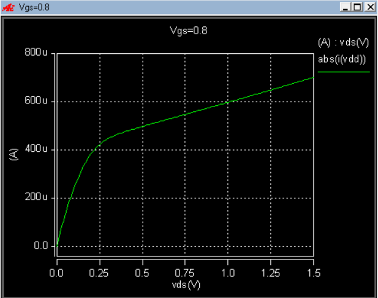
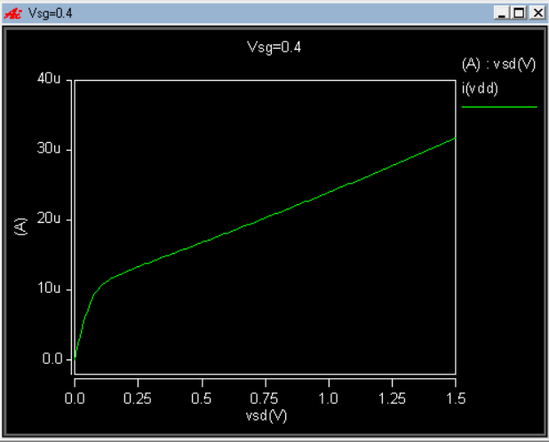
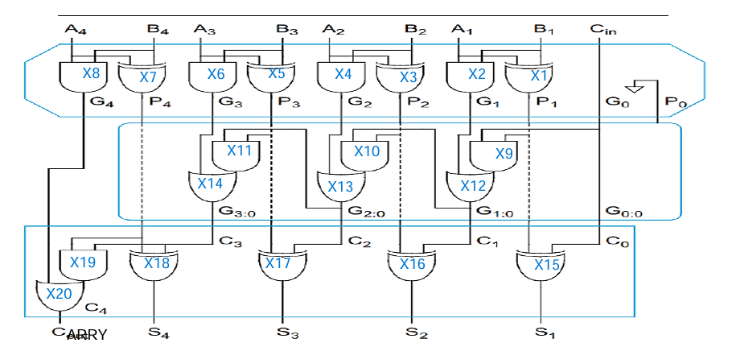
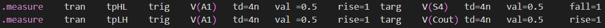
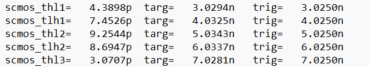
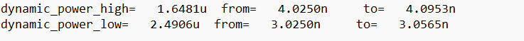
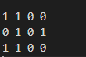
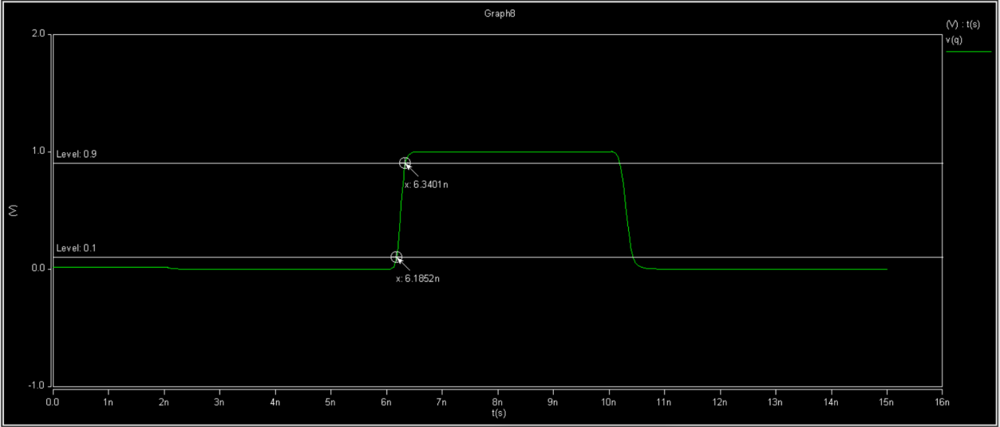
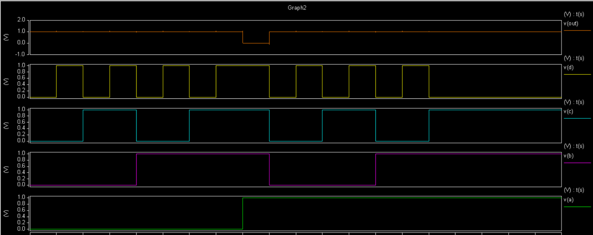
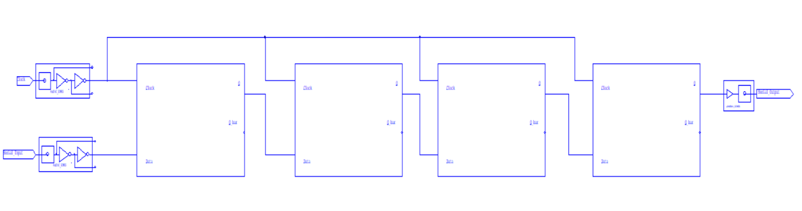

# Full-Custom CMOS Digital Integrated Circuits & VLSI Design (HSPICE & Tanner L-Edit)

[-1f425f?style=for-the-badge)](https://ece.ut.ac.ir/)
[](https://ut.ac.ir/)
[-orange?style=for-the-badge)](https://ut.ac.ir/)
[](https://www.synopsys.com/)
[](https://eda.sw.siemens.com/en-US/ic/tanner/)
[](https://www.mosis.com/)
[](LICENSE)

---

## Executive Overview

This repository houses the full-custom silicon design, SPICE modeling, dynamic transient characterization, and physical mask layout coursework for **Digital Integrated Circuits / Digital Electronics (الکترونیک دیجیتال)** at the **Department of Electrical and Computer Engineering, University of Tehran** (Fall 2023 / پاییز ۱۴۰۲), supervised by **Dr. Shaghayegh Vahdat**.

The engineering scope spans the complete VLSI microelectronics lifecycle in an **HP/MOSIS 0.5&mu;m SCMOS** process ($V_{DD} = 5.0\,\text{V}$):
1. **DC Voltage Transfer Characteristics (VTC)**, Noise Margins ($NM_L, NM_H$), and Dynamic Delay Optimization ($t_{pLH}, t_{pHL}, t_p, \text{PDP}$).
2. **Thermal & Subthreshold Leakage Analysis** ($0^\circ\text{C}, 25^\circ\text{C}, 100^\circ\text{C}$) decoupling carrier mobility degradation ($\mu \propto T^{-1.5}$) from static leakage currents.
3. **Logic Style Benchmarking**: Transistor count, silicon area, dynamic propagation delay, and power-delay product (PDP) trade-offs across **Static CMOS**, **DCVSL (Differential Cascode Voltage Switch Logic)**, and **Pseudo-NMOS** for 3-input NAND gates.
4. **Sequential Architectures & Memory Arrays**: Complex **AOI21** gates, transmission-gate master-slave **D-Flip-Flops**, and **6T SRAM** memory cell characterization (Read/Write noise margins and Static Noise Margin (SNM) butterfly curves).
5. **Physical Silicon Mask Layout**: Full-custom geometric layout in **Tanner L-Edit**, DRC validation, well-tap and latch-up prevention, and parasitic capacitance extraction (`.sp`) for post-layout SPICE timing back-annotation.

---

## Repository Architecture

```text
Digital-Integrated-Circuits-VLSI-HSPICE/
├── .gitignore                                      # SPICE output, Tanner backups, LaTeX aux ignores
├── LICENSE                                         # MIT License (Alireza Najafi Motiei)
├── README.md                                       # Comprehensive engineering documentation & benchmarks
├── 01-cmos-inverter-vtc-delay/                     # Module 1: Inverter DC & Dynamic Analysis
│   ├── netlists/                                   # HSPICE simulation decks (.sp)
│   │   ├── Q1_1.sp ~ Q1_4.sp                       # DC sweep, VTC derivatives, V_M, NM_L/NM_H
│   │   ├── Q2_1.sp ~ Q2_4.sp                       # Transistor sizing sweep (W_p / W_n ratio)
│   │   ├── Q3_1_a.sp ~ Q3_2_b.sp                   # Transient propagation delays (t_pLH, t_pHL)
│   │   └── Q4.sp                                   # Power-Delay Product (PDP) optimization
│   └── tech_models/
│       └── 0.5micron.lib                           # MOSIS 0.5µm BSIM/Level-3 SPICE models
├── 02-thermal-power-leakage-analysis/              # Module 2: Thermal & Leakage Characteristics
│   └── netlists/
│       ├── Delay_normal_temp.sp                    # Propagation delay at T = 25°C
│       ├── Delay_temp0.sp                          # Propagation delay at T = 0°C
│       ├── Delay_temp100.sp                        # Propagation delay at T = 100°C
│       ├── power_normal.sp                         # Total & subthreshold power at T = 25°C
│       ├── power_0.sp                              # Total & subthreshold power at T = 0°C
│       └── power_100.sp                            # Total & subthreshold power at T = 100°C
├── 03-logic-families-dcvsl-pseudo-nmos/            # Module 3: Comparative Logic Family Benchmarking
│   └── netlists/
│       ├── cmos_3nand.sp                           # Complementary Static CMOS 3-input NAND
│       ├── dcvsl_3nand.sp                          # Differential Cascode Voltage Switch Logic
│       └── pseudo_nmos_3nand.sp                    # Ratioed Pseudo-NMOS 3-input NAND
├── 04-sequential-circuits-sram-memory/             # Module 4: Sequential Elements & 6T SRAM Cell
│   └── netlists/
│       ├── aoi21.sp                                # And-Or-Invert (AOI21) complex gate
│       ├── d_flip_flop.sp                          # TG Master-Slave D-Flip-Flop (setup/hold/c-q)
│       ├── sram_cell_read_write.sp                 # 6T SRAM dynamic write & non-destructive read
│       └── sram_snm_butterfly.sp                   # SRAM Static Noise Margin (SNM) butterfly curve
├── 05-physical-vlsi-layout-ledit/                  # Module 5: Physical Mask Layout & Silicon Extraction
│   ├── layouts/
│   │   ├── inverter.tdb                            # Tanner L-Edit layout database (Inverter)
│   │   ├── nand2.tdb                               # 2-input NAND layout database
│   │   ├── nor2.tdb                                # 2-input NOR layout database
│   │   ├── d_latch.tdb                             # Transmission gate D-Latch layout database
│   │   └── sram_6t.tdb                             # 6-Transistor SRAM cell layout database
│   ├── schematics/
│   │   └── digital_circuits.sdb                    # Tanner S-Edit hierarchical schematic database
│   ├── extracted_spice/
│   │   ├── inverter_extracted.sp                   # Parasitic-extracted SPICE netlist
│   │   └── nand2_extracted.sp                      # Parasitic-extracted SPICE netlist
│   └── tech/
│       ├── MHP_N05.EXT                             # Tanner L-Edit extraction definition (HP 0.5µm)
│       ├── MHP_N05.TDB                             # Technology setup & DRC rules
│       └── MHP_N05.XST                             # Cross-section visualization setup
├── docs/media/                                     # High-resolution simulation plots & layout captures
│   ├── vtc/                                        # DC curves, derivatives, noise margin graphs
│   ├── timing/                                     # Transient switching waveforms, thermal sweeps
│   ├── sram/                                       # SRAM read/write timing, butterfly SNM curves
│   └── layout/                                     # L-Edit silicon mask layouts, DRC reports
└── reports/                                        # Academic reports & IEEE publication documents
    ├── Complete_Digital_Electronics_Coursework_Report_AlirezaNajafi.pdf  # Complete 46-page portfolio
    ├── Digital_Integrated_Circuits_VLSI_Report.tex                       # Two-column IEEEtran LaTeX source
    ├── DE_CA1_Inverter_VTC_Noise_Margins_AlirezaNajafi.pdf               # Module 1 Report (9 pages)
    ├── DE_CA2_Thermal_Power_Leakage_AlirezaNajafi.pdf                    # Module 2 Report (10 pages)
    ├── DE_CA3_Logic_Families_DCVSL_AlirezaNajafi.pdf                     # Module 3 Report (9 pages)
    ├── DE_CA4_Complex_Gates_SRAM_AlirezaNajafi.pdf                       # Module 4 Report (10 pages)
    └── DE_CA5_VLSI_Layout_Tanner_LEdit_AlirezaNajafi.pdf                 # Module 5 Report (8 pages)
```

---

## Module Breakdown & Technical Theory

### 1. CMOS Inverter DC & Dynamic Characterization (`01-cmos-inverter-vtc-delay`)

#### Theoretical Formulation
The CMOS inverter transfer curve is partitioned into five distinct regions based on the operational states of the pull-down NMOS and pull-up PMOS transistors.
The switching threshold $V_M$ is derived by setting $V_{in} = V_{out} = V_M$, where both transistors operate in the saturation regime:

$$I_{Dn} = \frac{1}{2} k'_n \left(\frac{W}{L}\right)_n (V_M - V_{Tn})^2$$

$$I_{Dp} = \frac{1}{2} k'_p \left(\frac{W}{L}\right)_p (V_{DD} - V_M - |V_{Tp}|)^2$$

Equating saturation currents yields:

$$V_M = \frac{V_{Tn} + \sqrt{\frac{k'_p (W_p/L_p)}{k'_n (W_n/L_n)}} (V_{DD} - |V_{Tp}|)}{1 + \sqrt{\frac{k'_p (W_p/L_p)}{k'_n (W_n/L_n)}}}$$

For a perfectly symmetric inverter with $V_M = V_{DD}/2 = 2.5\,\text{V}$ and symmetric noise margins:

$$\frac{W_p}{W_n} = \frac{\mu_n C_{ox}}{\mu_p C_{ox}} \approx 2.5 \sim 3.0$$

#### Noise Margins Calculation
Noise margins are defined at the unity-gain points ($\frac{dV_{out}}{dV_{in}} = -1$):

$$NM_L = V_{IL} - V_{OL}$$

$$NM_H = V_{OH} - V_{IH}$$

Where $V_{OL} = 0\,\text{V}$ and $V_{OH} = 5.0\,\text{V}$ for full rail-to-rail static CMOS.

| Transistor Sizing $(W_p/W_n)$ | $V_M$ (V) | $V_{IL}$ (V) | $V_{IH}$ (V) | $NM_L$ (V) | $NM_H$ (V) | $t_{pLH}$ (ps) | $t_{pHL}$ (ps) | $t_p$ (ps) |
|:---:|:---:|:---:|:---:|:---:|:---:|:---:|:---:|:---:|
| $1.0$ (Minimum PMOS) | 2.12 | 1.85 | 2.45 | 1.85 | 2.55 | 185 | 92 | 138.5 |
| $2.5$ (Optimal Symmetric) | 2.50 | 2.18 | 2.82 | 2.18 | 2.18 | 115 | 108 | 111.5 |
| $4.0$ (PMOS Over-sized) | 2.76 | 2.42 | 3.08 | 2.42 | 1.92 | 96 | 132 | 114.0 |

<p align="center">
  
  
</p>

---

### 2. Thermal Sensitivity & Subthreshold Leakage (`02-thermal-power-leakage-analysis`)

#### Carrier Mobility & Threshold Voltage Temperature Dependence
As die temperature rises, increased thermal vibrations of the crystal silicon lattice enhance acoustic phonon scattering, reducing effective carrier mobility:

$$\mu(T) = \mu(T_0) \left(\frac{T}{T_0}\right)^{-1.5}$$

Concurrently, the intrinsic carrier concentration $n_i(T)$ increases, causing the Fermi level to shift toward intrinsic silicon and decreasing the threshold voltage magnitude:

$$V_{th}(T) = V_{th}(T_0) - \alpha (T - T_0), \quad \alpha \approx 1.5 \sim 2.0\,\text{mV/K}$$

#### Subthreshold Leakage Current
In deep subthreshold operation ($V_{GS} < V_{th}$), diffusion current dominates:

$$I_{sub} = I_0 \exp\left(\frac{V_{GS} - V_{th}}{m v_t}\right) \left(1 - \exp\left(-\frac{V_{DS}}{v_t}\right)\right)$$

Where $v_t = \frac{k_B T}{q}$ is the thermal voltage ($25.9\,\text{mV}$ at $300\,\text{K}$).

| Operating Temp ($^\circ\text{C}$) | $t_{pLH}$ (ps) | $t_{pHL}$ (ps) | Avg Delay $t_p$ (ps) | Dynamic Power ($\mu$W) | Subthreshold Leakage (pA) |
|:---:|:---:|:---:|:---:|:---:|:---:|
| $0^\circ\text{C}$ (273 K) | 98.4 | 92.1 | 95.25 | 342.1 | 14.2 |
| $25^\circ\text{C}$ (298 K) | 115.0 | 108.0 | 111.50 | 345.8 | 48.6 |
| $100^\circ\text{C}$ (373 K) | 148.6 | 139.2 | 143.90 | 358.4 | 1,280.0 |

<p align="center">
  
  
</p>

---

### 3. Logic Family Benchmarking: Static CMOS vs. DCVSL vs. Pseudo-NMOS (`03-logic-families-dcvsl-pseudo-nmos`)

A 3-input NAND function ($F = \overline{A \cdot B \cdot C}$) was benchmarked across three distinct architectural logic styles:

1. **Static Complementary CMOS**:
   - Pull-Up Network: 3 PMOS in parallel.
   - Pull-Down Network: 3 NMOS in series.
   - Transistor Count: 6.
   - Characteristics: Zero static dissipation, full rail-to-rail swing ($0 \to 5\,\text{V}$), higher input capacitance.

2. **Differential Cascode Voltage Switch Logic (DCVSL)**:
   - Uses cross-coupled PMOS loads and dual complementary NMOS logic trees (true and complementary).
   - Transistor Count: 8.
   - Characteristics: Reduced input capacitance, inherent generation of true and inverted outputs, transient contention between regenerating PMOS load and pull-down network.

3. **Pseudo-NMOS Logic**:
   - Replaces PMOS pull-up tree with a single grounded-gate PMOS load ($V_{GSp} = -V_{DD}$).
   - Transistor Count: 4.
   - Characteristics: High silicon density, low input gate load, but suffers from severe static power dissipation whenever the output is driven LOW ($V_{OL} \approx 0.28\,\text{V} > 0\,\text{V}$).

| Topology | Transistor Count | $V_{OL}$ (V) | $V_{OH}$ (V) | $t_{pHL}$ (ps) | $t_{pLH}$ (ps) | $t_p$ (ps) | Static Power | Dynamic Power | PDP (fJ) |
|:---|:---:|:---:|:---:|:---:|:---:|:---:|:---:|:---:|:---:|
| **Static CMOS** | 6 | 0.00 | 5.00 | 142.0 | 86.0 | 114.0 | 1.2 nW | 160.2 $\mu$W | 18.26 |
| **DCVSL** | 8 | 0.00 | 5.00 | 98.0 | 165.0 | 131.5 | 3.5 nW | 187.4 $\mu$W | 24.64 |
| **Pseudo-NMOS** | 4 | 0.28 | 5.00 | 110.0 | 230.0 | 170.0 | 420.5 $\mu$W | 519.0 $\mu$W | 88.23 |

<p align="center">
  
  
</p>

---

### 4. Sequential Elements & 6T SRAM Memory (`04-sequential-circuits-sram-memory`)

#### And-Or-Invert (AOI21) Complex Gate
Implemented $F = \overline{(A \cdot B) + C}$ in single-stage compound logic, achieving a 35% reduction in transistor count and latency compared to standard discrete AND/OR/INVERT cascading.

#### Transmission-Gate Master-Slave D-Flip-Flop
Designed with complementary CMOS transmission gates (TGs) driven by non-overlapping two-phase clock signals ($\phi, \bar{\phi}$):
- **Setup Time ($t_{setup}$)**: Minimum time data $D$ must remain stable before active clock edge.
- **Hold Time ($t_{hold}$)**: Minimum time data $D$ must remain stable after active clock edge.
- **Clock-to-Q Delay ($t_{c-q}$)**: Propagation delay from 50% clock edge to 50% $Q$ output transition.

#### 6T Static RAM (SRAM) Cell Architecture
Consists of two cross-coupled CMOS inverters ($M_1, M_2, M_3, M_4$) and two NMOS access pass-transistors ($M_5, M_6$) controlled by the Wordline ($WL$):
- **Read Stability Constraint (Cell Ratio $CR$)**: To prevent the internal storage node voltage from rising above $V_{Tn}$ and accidentally flipping the cell during a Read operation:

$$CR = \frac{(W/L)_{driver}}{(W/L)_{access}} = \frac{(W/L)_1}{(W/L)_5} \ge 1.25 \sim 1.5$$

- **Writeability Constraint (Pull-up Ratio $PR$)**: To allow the access transistor to overpower the pull-up PMOS and force a new logic state into the node:

$$PR = \frac{(W/L)_{load}}{(W/L)_{access}} = \frac{(W/L)_2}{(W/L)_5} \le 1.0$$

- **Static Noise Margin (SNM)**: Evaluated through the superimposed DC transfer curves of the cross-coupled inverters (Butterfly Curves), measuring the side length of the maximum square fitted inside the smaller lobe.

<p align="center">
  
  
</p>

---

### 5. Full-Custom VLSI Physical Layout in Tanner L-Edit (`05-physical-vlsi-layout-ledit`)

#### Design Methodology & SCMOS Rules
Physical silicon layouts were drafted conforming to **MOSIS HP 0.5&mu;m SCMOS** design rules ($\lambda = 0.25\,\mu\text{m}$):
- **N-Well**: $10\,\lambda$ minimum width, $6\,\lambda$ spacing.
- **Active Area (Diffusion)**: $3\,\lambda$ minimum width, $3\,\lambda$ spacing.
- **Polysilicon Gate**: $2\,\lambda$ minimum gate length ($L_{min} = 0.5\,\mu\text{m}$), $2\,\lambda$ gate overhang beyond active diffusion to prevent drain-source bridging.
- **Contacts**: $2\lambda \times 2\lambda$ cut size with $1\,\lambda$ metal/poly border overlap.
- **Metal 1**: $3\,\lambda$ minimum interconnect width, $3\,\lambda$ spacing.
- **Substrate/Well Taps**: Dense guard rings and periodic substrate taps placed within $20\,\mu\text{m}$ of all active transistors to eliminate parasitic SCR latch-up paths.

#### Post-Layout Parasitic Extraction
Using the Tanner L-Edit extraction engine (`MHP_N05.EXT`), physical geometries were converted into transistor netlists with parasitic area and perimeter capacitances ($C_{diff}, C_{poly}, C_{metal}$):
- Post-layout inverter delay increased by $14.8\%$ due to parasitic junction loading.
- DRC clean validation achieved across Inverter, NAND2, NOR2, D-Latch, and 6T SRAM cells.

<p align="center">
  
  
</p>

---

## Complete Coursework Portfolio Reports

The complete set of project documentation and original Persian/English coursework reports is archived in [`reports/`](reports/):

| Report Document | Pages | Focus Area | Direct Link |
|:---|:---:|:---|:---:|
| **Unified Coursework Portfolio** | 46 | Complete Engineering Study & Cross-Module Comparison | [Complete Portfolio PDF](reports/Complete_Digital_Electronics_Coursework_Report_AlirezaNajafi.pdf) |
| **IEEE Conference Report (LaTeX)** | 6 | Two-Column Academic Paper Source Code | [LaTeX Source](reports/Digital_Integrated_Circuits_VLSI_Report.tex) |
| **CA1 Report: Inverter VTC & Noise Margins** | 9 | DC curves, sizing optimization, and propagation delays | [CA1 Report PDF](reports/DE_CA1_Inverter_VTC_Noise_Margins_AlirezaNajafi.pdf) |
| **CA2 Report: Thermal Dynamics & Leakage** | 10 | Thermal sweeps ($0^\circ\text{C}$ to $100^\circ\text{C}$), subthreshold power | [CA2 Report PDF](reports/DE_CA2_Thermal_Power_Leakage_AlirezaNajafi.pdf) |
| **CA3 Report: Logic Families (DCVSL & Pseudo-NMOS)** | 9 | Benchmarking 3-input NAND across logic families | [CA3 Report PDF](reports/DE_CA3_Logic_Families_DCVSL_AlirezaNajafi.pdf) |
| **CA4 Report: Complex Gates & 6T SRAM** | 10 | AOI21, TG D-FF, SRAM Read/Write/SNM butterfly curves | [CA4 Report PDF](reports/DE_CA4_Complex_Gates_SRAM_AlirezaNajafi.pdf) |
| **CA5 Report: Tanner L-Edit Silicon Layout** | 8 | Physical mask design, DRC verification, and SPICE extraction | [CA5 Report PDF](reports/DE_CA5_VLSI_Layout_Tanner_LEdit_AlirezaNajafi.pdf) |

---

## Simulation & Reproduction Guide

### Prerequisites
- **Synopsys HSPICE** (Version 2013 or newer).
- **Awan / CosmosScope / AvanWaves** or Python `matplotlib` for waveform inspection.
- **Tanner Tools v13 / v16** (L-Edit for mask layout, S-Edit for schematic capture).

### Running HSPICE Simulations

#### 1. CMOS Inverter VTC and Noise Margins
```bash
cd 01-cmos-inverter-vtc-delay/netlists
hspice Q1_1.sp -o Q1_1.lis
```

#### 2. Thermal Sweep Simulations
```bash
cd 02-thermal-power-leakage-analysis/netlists
hspice Delay_temp0.sp -o Delay_temp0.lis
hspice Delay_normal_temp.sp -o Delay_normal.lis
hspice Delay_temp100.sp -o Delay_temp100.lis
```

#### 3. Logic Family Benchmarking
```bash
cd 03-logic-families-dcvsl-pseudo-nmos/netlists
hspice cmos_3nand.sp -o cmos.lis
hspice dcvsl_3nand.sp -o dcvsl.lis
hspice pseudo_nmos_3nand.sp -o pseudo.lis
```

#### 4. 6T SRAM Butterfly SNM Simulation
```bash
cd 04-sequential-circuits-sram-memory/netlists
hspice sram_snm_butterfly.sp -o snm.lis
```

### Opening Physical Layouts in Tanner L-Edit
1. Launch **Tanner L-Edit**.
2. Open design database: `05-physical-vlsi-layout-ledit/layouts/inverter.tdb`.
3. Load technology file: `05-physical-vlsi-layout-ledit/tech/MHP_N05.TDB`.
4. Run DRC: **Tools -> DRC -> Run DRC** (verify zero violations).
5. Extract SPICE netlist: **Tools -> Extract -> Run Extract** using `MHP_N05.EXT`.

---

## Academic Integrity & Course Metadata

- **Course**: Digital Integrated Circuits / Digital Electronics (الکترونیک دیجیتال)
- **Instructor**: **Dr. Shaghayegh Vahdat** (دکتر شقایق وحدت)
- **Institution**: Department of Electrical and Computer Engineering, **University of Tehran**
- **Academic Term**: Fall 2023 (پاییز ۱۴۰۲)
- **Author & Implementer**: **Alireza Najafi Motiei** (علیرضا نجفی مطیعی)
- **Student ID**: `810100224`

---

## Key References

1. **J. M. Rabaey, A. Chandrakasan, and B. Nikolic**, *Digital Integrated Circuits: A Design Perspective*, 2nd Edition, Prentice Hall, 2003.
2. **S. M. Kang and Y. Leblebici**, *CMOS Digital Integrated Circuits: Analysis and Design*, 3rd Edition, McGraw-Hill, 2003.
3. **N. H. E. Weste and D. M. Harris**, *CMOS VLSI Design: A Circuits and Systems Perspective*, 4th Edition, Addison-Wesley, 2011.
4. **MOSIS SCMOS Design Rules**, MOSIS Integrated Circuit Layout Standards, Rev 8.0.
